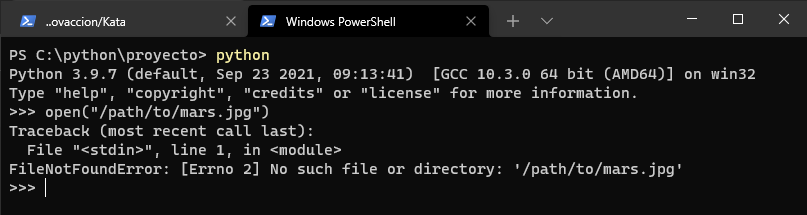

# **Módulo 10 - Manejo de errores**

## Introducción

Incluso el código mejor escrito contendrá errores. Los errores pueden producirse debido a actualizaciones, archivos movidos u otros cambios inesperados. Afortunadamente, Python ofrece una amplia compatibilidad para el seguimiento y el control de errores.

## Uso de tracebacks para buscar errores

Las excepciones en Python son una característica principal del lenguaje. Es posible que te sorprenda leer que algo que genera errores se resalta como una característica. Esta sorpresa puede deberse a que las herramientas de software sólidas no parecen bloquearse con un traceback *seguimiento* (varias líneas de texto que indican cómo se inició y finalizó el error).

Sin embargo, las excepciones son útiles porque ayudan en la toma de decisiones generando mensajes de error descriptivos. Pueden ayudarte a controlar los problemas esperados e inesperados.

## Tracebacks

Un traceback es el cuerpo del texto que puede apuntar al origen (y al final) de un error no controlado. Comprender los componentes de un traceback hará que seas más eficaz al corregir errores o depurar un programa que no funciona bien.

La primera vez que encuentres excepciones en Python podrías verte tentado/a a evitar el error suprimiéndolo. Cuando un programa sufre un error no controlado, aparece un traceback como salida. Como verás en este módulo, los tracebacks son útiles. Hay maneras de controlar correctamente los errores para que no aparezcan o muestren información útil.

Si intentamos en un notebook, abrir un archivo inexistente sucede lo siguiente:



Esa salida tiene varias partes clave. En primer lugar, el traceback menciona el orden de la salida. Después, informa de que el archivo es `stdin` (entrada en el terminal interactivo) en la primera línea de la entrada. El error es `FileNotFoundError` (el nombre de excepción), lo que significa que el archivo no existe o quizás el directorio correspondiente no existe.

Es mucha información. Puede ser difícil entender por qué la línea 1 es significativa o qué significa `Errno 2`.

Intenta crear un archivo de Python y asígnale el nombre  *open.py* , con el contenido siguiente:

```
$ python config.py
Traceback (most recent call last):
  File "/tmp/config.py", line 9, in <module>
    main()
  File "/tmp/config.py", line 3, in main
    configuration = open('config.txt')
IsADirectoryError: [Errno 21] Is a directory: 'config.txt'
```

Una manera poco útil de controlar este error sería detectar todas las excepciones posibles para evitar un traceback. Para comprender por qué detectar todas las excepciones es problemático, probaremos actualizando la función `main()`:

```
def main():
    try:
        configuration = open('config.txt')
    except Exception:
        print("Couldn't find the config.txt file!")
```

```
$ python config.py
Couldn't find the config.txt file!
```

El problema ahora es que el mensaje de error es incorrecto. El archivo existe, pero tiene permisos diferentes y Python no puede leerlo. Cuando se trata con errores de software, puede resultar frustrante tener errores que hagan lo siguiente:

* No indiquen cuál es el problema real.
* Proporcionen una salida que no coincida con el problema real.
* No sugieran lo que se puede hacer para corregir el problema.

Vamos a corregir este fragmento de código para abordar todas estas frustraciones. Revertiremos la detección de `FileNotFoundError` y luego agregamos otro bloque `except` para detectar `PermissionError`:

```
def main():
    try:
        configuration = open('config.txt')
    except FileNotFoundError:
        print("Couldn't find the config.txt file!")
    except IsADirectoryError:
        print("Found config.txt but it is a directory, couldn't read it")
```

Ahora volvemos a ejecutarlo, en el mismo lugar donde *config.txt* está con el problema de permisos:

```
$ python config.py
Found config.txt but couldn't read it
```

Cuando los errores son de una naturaleza similar y no es necesario controlarlos individualmente, puedes agrupar las excepciones como una usando paréntesis en la línea `except`. Por ejemplo, si el sistema de navegación está bajo cargas pesadas y el sistema de archivos está demasiado ocupado, tiene sentido detectar `BlockingIOError` y `TimeOutError` juntos:

```
def main():
    try:
        configuration = open('config.txt')
    except FileNotFoundError:
        print("Couldn't find the config.txt file!")
    except IsADirectoryError:
        print("Found config.txt but it is a directory, couldn't read it")
    except (BlockingIOError, TimeoutError):
        print("Filesystem under heavy load, can't complete reading configuration file")
```


```

```
