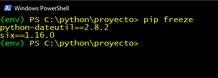

# Ejercicio - Crear un paquete

En este ejercicio, aprenderás a utilizar entornos virtuales como una forma para no afectar a los paquetes instalados globalmente u otros programas que se ejecutan en tu máquina.

## Crear un entorno virtual

* Crear un entorno virtual mediante `venv`

```
python3 -m venv env
```

Resultado: 


* Ejecutar el comando para activar el entorno virtual PowerShell `.\env\bin\Activate.ps1`

```
#powershell
.\env\bin\Activate.ps1

# Windows
env\bin\activate
```

Resultado: 


## Instalar una biblioteca

Ahora que estás dentro de tu entorno virtual, puedes instalar una biblioteca y saber que la biblioteca solo existirá en el entorno virtual.

* Ejecuta el comando `pip freeze` para ver las bibliotecas instaladas en tu entorno:

  ```
  pip freeze
  ```
* Ejecuta el comando `pip install` para instalar una biblioteca:

  ```
  pip install python-dateutil
  ```

Resultado: 


* Vuelve a ejecutar `pip freeze` para ver cómo ha cambiado tu lista de bibliotecas:

```
pip freeze
```

* Ahora deberías ver la siguiente lista:

 

## Desactivar un entorno  Virtual 

Hasta ahora, has creado un entorno virtual y le has agregado un paquete. Sin embargo, es posible que estés trabajando en varios proyectos de Python y necesites cambiar entre ellos. Para hacer eso, debes salir (desactivar) tu entorno virtual.

* Ejecuta el comando `deactivate`:

  ```
  deactivate
  ```
